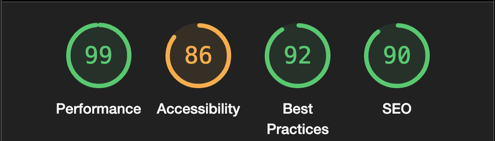

Testing and Bugs
================

-   [Testing and Bugs](#testing-and-bugs)

-   Testing

-   Responsiveness

-   Cross-Browser Capability

-   Site component behaviour

-   Bugs

-   Materialize issues

    -   Navigation bar

    -   Scrollspy

-   Other bugs and learning

-   Defensive programming

    -   Vote up / Vote down

    -   Sorting options

-   More ‘granular’ detail ;)

 

# Testing

This project was manually tested. Significant bugs were [raised and squashed](https://github.com/dandavies23/jargon-unchained/issues?q=label%3Abug+is%3Aclosed) within the Github issues.

The forms were validated in the JUC GUI with one [significant bug](https://github.com/dandavies23/jargon-unchained/issues/25) having an impact on the integrity of the main Jargon database. 

The following testing steps were taken to see if there were any conflicts between the form entry the UI in MongoDB. 

**From the JUC UI**

Create and Login as new user  ✅

Login as user ✅

Add Jargon entry ✅

Login as user in Mongo DB - check database ✅

Leave 'extended rant' empty ✅

Submit dictionary entry

Update own extended rant ✅

Login as user in Mongo DB - check database ✅

Add completed entry to importdb (a ‘fixture’) incase bug happens again ✅

See entry under login ✅

 

**Login as Admin** ✅

Change new Jargon entry (corrected rant "And that's cool right?” ) ✅

Delete entry ✅

Login as user in Mongo DB - check database ✅

Vote up  ✅

Vote Down  ✅

Reorder: A-Z, Z-A, 1-9 Shuffle  ✅

Delete user  ✅

Delete a used category  ✅

Login as user in Mongo DB - check database ✅

_None of these steps created any corruption or deletion of data entries_

**Two possible reasons this may have previously happened**

1. Two logins from MongoDB (from previous this and previous Walkthroughs)
- Solution: Only using dan@dandavies23.com stopped using 'root'
2. MongoDB and UI were worked on concurrently causing a version error
- Solution: Only open up MongoDb and check when needed. 

The database has been stored as a 'fixture' incase the issue should return. If so point app.py ```@app.route("/load_databases/")
def load_databases():``` to ```importdb.py```


# Responsiveness

## Desired Result

The site must display on any screen size without compromising legibility and
eliminating screen and element overflow.


## Steps taken to ensure result

The library [Materialize](https://materializecss.com/) was used as a
lightweight, grid-system CSS which ensured responsiveness to any screen size or device type. Materialize’s 'flow-text' class was applied to all main text fields.

Further CSS media query customisation was employed to fix additional scaling issues. Particularly on mobile devices.

The Chrome developer tool was used and tested on an iPhone X, iPhone6 and a Moto G4 emulator during a responsiveness sprint.


### Verdict

Jargon Unchained adapts well to all screen sizes and devices. ✔️

 

## Cross-Browser Compatibility
---------------------------

Display correctly in any browser except Internet Explorer.

### Steps taken to ensure result

The following browsers were used to check compatibility during build:

-   Google Chrome

-   Safari

-   Opera

The following screen sizes OS and browsers were tested in Browserstack screenshots from the testing can be found here.

### Verdict

Jargon Unchained works across all main modern browsers. ✔️

Further real device and cross browser testing was undertaken using
[Lambda Test](https://links.lambdatest.com/)

## Code validation

[Lighthouse](https://developers.google.com/web/tools/lighthouse) 
 It scored very highly apart from the 
Acessibility colour contrast which was inherited from the ebook. 
Steps to mitigate this are explained further in 'Colour Scheme' in the README.
[W3C Markup Validation Service](https://validator.w3.org/)
- Fixed small errors, only large one relates to Scrollspy widget see REAMDE.
[W3C CSS Validation Service](https://jigsaw.w3.org/) 
- Only errors here related to vendor extensions for Materialise and Font Awesone


## Site Components Behaviour
-------------------------

### Navigation and orientation

-   Click on navigation links to confirm correct redirection to the appropriate
    pages ✔️

-   Verify correct transition of navigation links on hover ✔️

-   Verify lightening on button hover jargon dictionary ✔️

-   Verify that the so-called **'burger'** menu icon displays on smaller
    screens ✔️

-   Verify that on clicking of the **'burger** icon triggers visibility of the
    vertical navigation menu for smaller screens ✔️

-   Verify that the the appropriate navigation displayed dependent on user or
    superuser login ✔️

-   Verify that scrollspy side navigation functions or is removed on smaller
    screens and give more space on medium view ✔️

-   Navbar is same colour as illustration to blend in with the navbar ✔️

-   Verify that logo is displayed on all pages - gave full URL of asset to fix
    update record display issue in base html ✔️

 

### Dictionary page

-   Search function works and is easy to use ✔️

-   All records are displaying ✔️

-   'Extended rant’ (further context) is viewable in collapsable / green and
    linked to edit when not complete ✔️

-   Vote / edit / sort buttons visible dependent user or superuser login ✔️

-   Warning modal to make sure user really wants to delete ✔️

 

### Form pages 

-   Form is clear in card element ✔️

-   Clear use of iconography for visual guidance ✔️

-   Labelling is clear, concise friendly in tone ✔️

-   Inputting is easy even on mobile views ✔️

-   Form validation prompt works - even on dropdown option ✔️

 

### Manage Categories / user’s Jargon entries

-   Simple card view allows you a noise-free overview and edit with ease ✔️

-   Cards stack well (single column) for mobile screens ✔️

-   Defensive programming - warning modal to make sure user really wants to
    delete ✔️

 

### Login / Registration

-   Form is clear in card element ✔️

-   Easy sign-up contribute

-   Clear use of iconography for visual guidance ✔️

-   Navigation between login and registering ✔️

-   Hashed password for login security using Weurkzeug ✔️

 

Bugs
----

A few bugs were found in the system which required squashing. These are detailed
below to aid further development.

 

### Materialize issues

Materialize was chosen as the lightweight responsive frame work. It was also
felt that some of the older design features (drop-shadows, cards) suited the
‘meta-corporate’ tone that the site aims to satirise. However the framework
itself it over three years old which is a long time in development and web
terms. As much as possible these bugs were squashed but some responsibility for
validation fails. Because this framework is depreciated it is recommended that
later versions of this platform use a different grid framework such as
Bootstrap.

 

### Navigation bar (Navbar)

**Bug**

The are a number of options with layout with the Materialize frame work for
navbar. I wanted the logo to sit in the central column for readability.
Unfortunately when testing the navbar there was an issue with the padding
presets. Furthermore although “extended” and “wrapper” classes were used the
logo words and icons pushed outside the container.

 

**Fix**

Logo and text were placed on the left with separate resize CSS, tested on all
sizes. Logo was resized for optimisation, (inline resize also didn’t work in
Internet Explore) then fixed for all screen sizes. Navigation icons were decided
against for accessibility reasons. A non-breaking space was added to the navbar 
title to prevent overspill. 

 

**Verdict**

Navbar is now displaying correctly.

 

### Scrollspy

**Bug**

This side navigation was a really useful way to navigate dictionary contents.
But this side bar isn’t really setup for a dictionary GET. There were various
bugs:

-   Side nav appearing at the bottom **Fix** attempted to squash with fixed
    positioning using [Materialize’s
    Pushpin](https://materializecss.com/pushpin.html)

-   Side nav wasn’t populating** Fix** changed its position in the for loop

-   Text occasionally overflows **Fix** fixed for most screen sizes using the
    grid and not showing on small

- Grid was rebuilt and pinned was abandoned which solved [bug #23](https://github.com/dandavies23/jargon-unchained/issues/23).

-   Side nav anchor tag wasn’t working - fed entry into anchor
    link field prefixed with a hash. On modern browsers space on anchortag
    is supplemented but W3 Validator [runs this as an error](https://validator.w3.org/nu/?doc=http%3A%2F%2Fjargon-unchained.herokuapp.com%2Fabout).

**Verdict: Partial fiz**

Currently scrollspy is working and it is a nice dynamic feature for navigating
the dictionary. But in further versions it is worth fixing the anchor tag issue
properly. Two solutions are:

1.  Introduce an index field which user or editor can oversee and control

2.  Within the app.py take the jargonname, find and replace “ “ with “-“ and
    lowercase then return it to scrollspy.

 

## Other bugs and learning

### Defensive programming

**Bug**

It was important to have a rigorous approach to this as deleting so final and
irreversible on the free version of MongoDB. The static version of Materialize’s
modal was dropped in but it didn’t activate the Modal.

**Fix**

It’s worth remembering that static anchor click isn’t going to work in a
dynamically created webpage. Instead the Javascript version of the plugin was
used and targeted using the component ID.

### Vote up / Vote Down

**Bug**

Issue with MongoDB storing integers which can be changed. It needed to be stored
as a string. It needed to then be converted to a number in python and
incremented up and down.

**Fix**

Correct code was written for conversion, various solutions for this were found
on Code Institute Slack and I understood the logic and worked through the
process.

 

### Sorting options

**Bug**

A “sort" function was easy to use with strings that. I made the mistake of
trying to do the same with a "love percent” rating variable. So it sorted on the
first digit.

**Fix**

Many thanks to Jo from Code Institute Tutor Support. We talked through the logic
of what I was trying to do and I wrote the correct [Function using
Lambda](https://www.geeksforgeeks.org/ways-sort-list-dictionaries-values-python-using-lambda-function/).

 

### More ‘granular’ detail

Other small bug fixes, issues and developments live within the [Jargon Unchained
Project Kanban](https://github.com/dandavies23/jargon-unchained/projects/1) on
Github. This will help with further sprints ‘going forwards’ ;)

 

 

 

 

 

 

 

 
-
